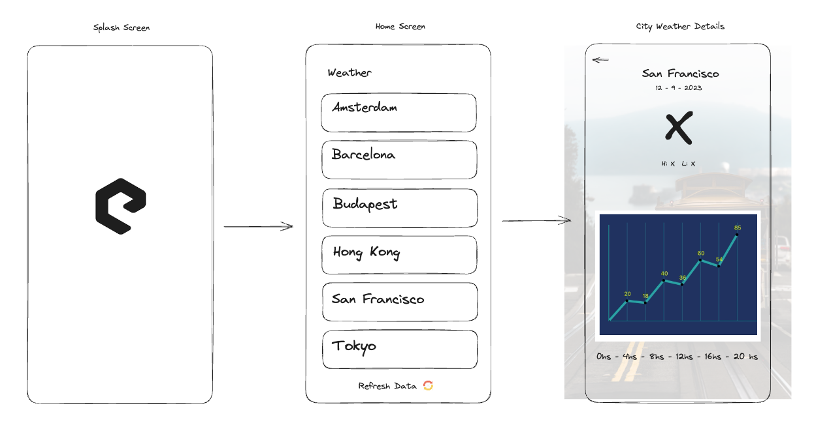

# Weather App

## General information

This repository holds a **weather app**. 🌤️

It was developed with **React Native**, **React Query**, **Typescript** and **Styled Components**! 🚀

You can run the app executing `npm run android` or `npm run ios`

## App Design

The first thing I have done was designing the app in UI Excalidraw. The result was the following:

## Coding details

- **Reusable components** were created. They are located in `src/components`.
- **Typographic reusable components** are located in `src/components/typography`.
- **A color palette and spacers values** were created inside of `src/theme` and shared through a `<ThemeProvider />` to all Styled Components.
- **WebP image support** was added to reduce app weight, as WebP images are lighter compared to PNG, JPG, JPEG and GIF formats.
- To handle **vertical spaces**, a reusable `<Spacer />` component was created.
- `<Snackbar />` component was used to inform when there is no connection to internet, and when the connection is re-established.
- `MMKV Storage` was used to implement the offline-first feature. The last API fetched data is always saved to the storage and if the internet connection is lost, the app reads the weather data from the async storage.
- **Unit tests** were created under a `__tests__` folder across the entire app.
- A **custom weather app icon** was created for both android and ios S.O.
- The library **Gifted Charts** was used to draw temperature values inside of `CityWeather` screen
- Dates were formatted with the library **date-fns**
- A custom **Splash screen** was created for both android and ios S.O.
- **API requests** are handled by **react query** which offers among other things: cache capabilities and error, isLoading and isRefetching states. Cache is being used so that the query returned value is cached by react query.
- An **Empty state screen** was created to show when there is an API request error.
- A **custom default image** was used for the **city images** when the internet connection is lost and untill the image is fetched from the internet.
- A **Loading** component was created with a **lottie animation**. It is rendered when the app is waiting for the API data.
- **Custom hooks** were created for both screens to handle logic, separate concerns and improve code legibility.

## User stories estimation and deadline

As a Reviewer, I want an mobile application that can show the weather data that is supplied by my server: (https://us-central1-mobile-assignment-server.cloudfunctions.net/weather)

- `1 point (install react query and implement fetch)`

As a User, I want to see a home screen with all the cities that are available on the API.

- `1 point`

As a User, I want the cities to be sorted alphabetically.

- `1 point`

As a User, I want to be able to refresh the data that is on the home screen.

- `1 point`

As a User, I want to be able to click on a city and see the weather results on a separate screen.

- `2 points (install react navigation - create stack - create new screen and style it)`

As a User, I want all the temperatures to be displayed in Celsius. The API returns also Fahrenheit and Kelvin, so they need to be converted:
Celsius = Kelvin - 273.15
Celsius = (Fahrenheit - 32) / 1.8

- `1 point (helper creation)`

As a User, I want the temperatures to be displayed in chronological order.

- `1 point`

As a Reviewer, I want the application to be offline-first. The data must be fetched from the API and must be stored in a database. If there is no internet the data from the database must be used.

- `2 points`

As a Reviewer, I want the application delivered in a zipped Git repo. The Git repo may not be published to a public location.
As a Reviewer, I want the application only to be optimized for mobile devices and in Portrait mode.

- `1 point (create repo, make it private, share it with Elements tech team)`

Having estimated all tasks I would say that **the whole challenge will take me between 3 and 4 days**, starting on Monday 11th and finishing it on Thirsday 14th, because I also had to consider:

- Application architecture.
- User experience.
- Performance.
- Error / Exception handling (e.g. no internet connection, backend errors). Offline mode / Caching strategies.
- Localisation. Optionally we also would like to see unit tests and/or UI tests.

## Architecture

I followed the SOLID principles because I:

- separated concerns through the whole app
- managed the app state with react query and its cache
- tried dividing the app in small modules/components/helpers that are testable in isolation
- created many specific interfaces rather than one large interface
- created the API request isolated so that it can be used somewhere else and modified easily
- created components to do only one specific thing
- implemented data transfer between components that is unidirectional (props are open, state is closed)
